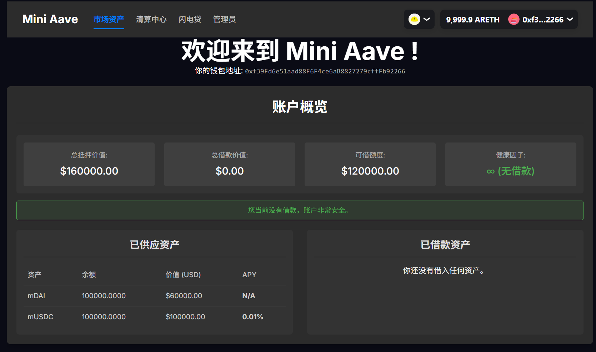
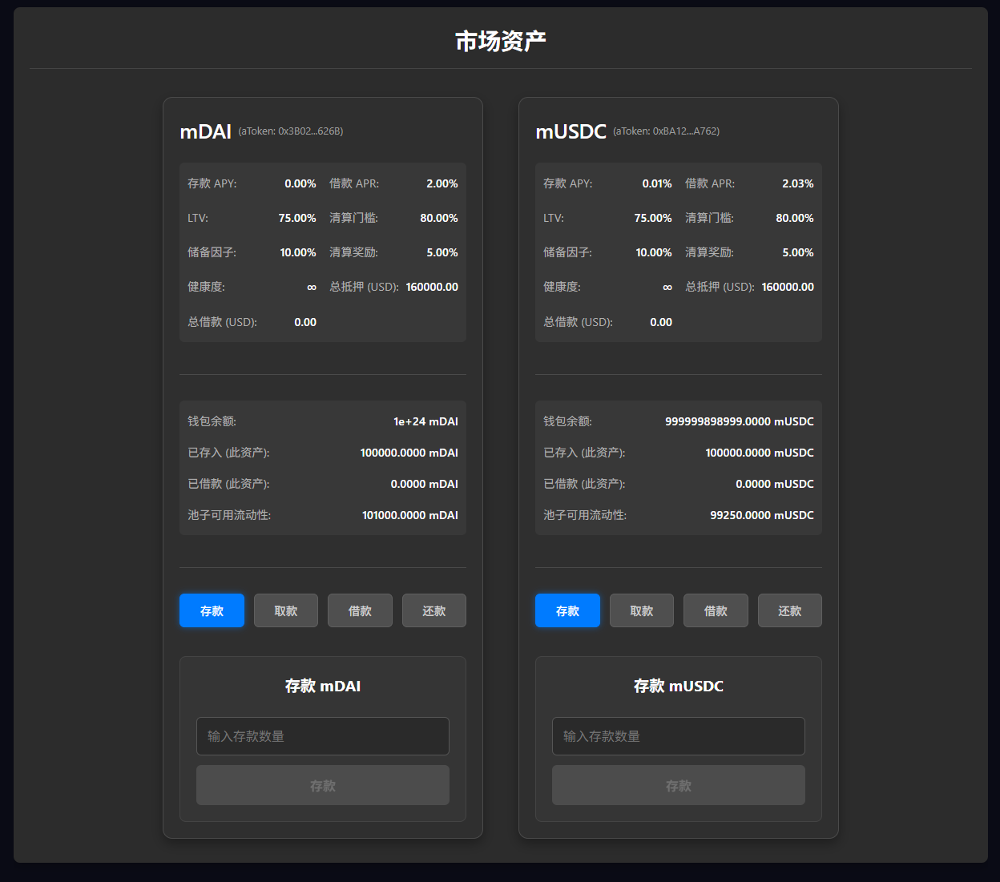
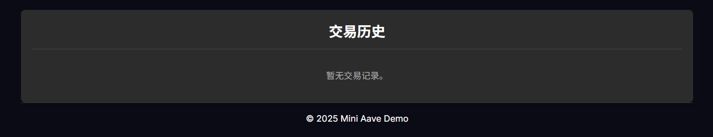
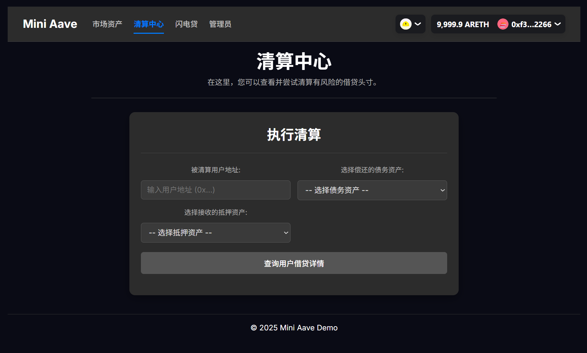
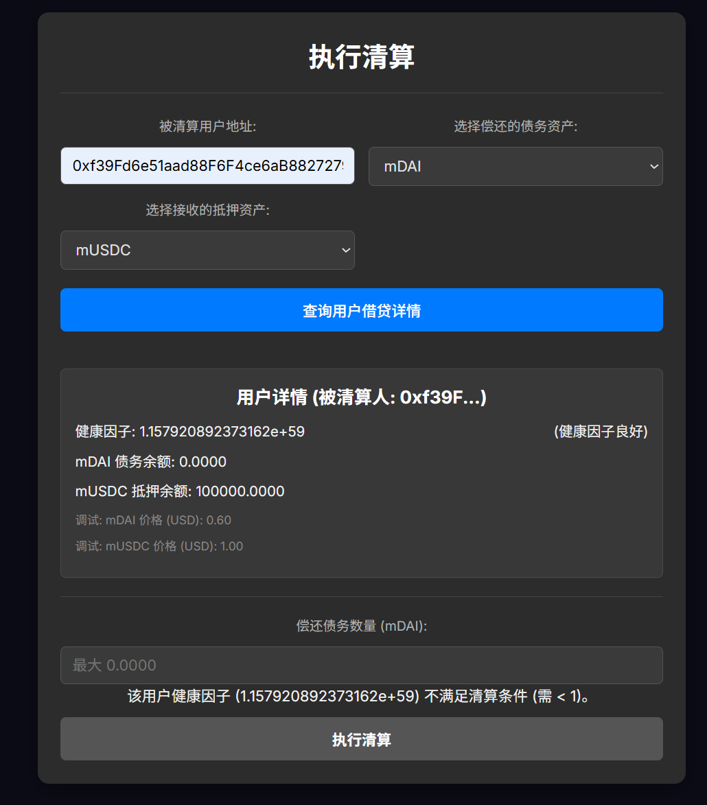
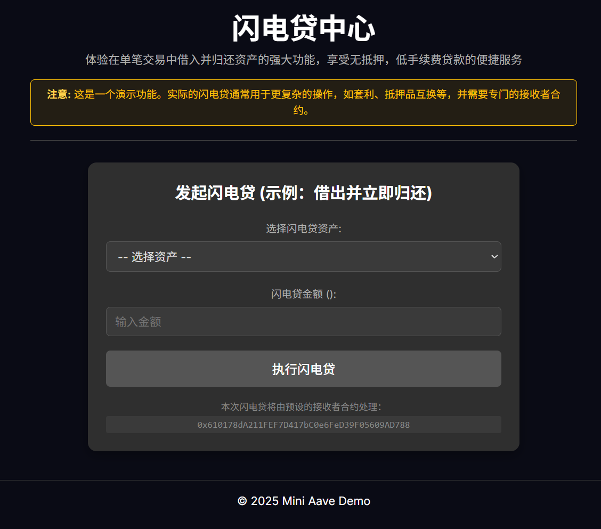
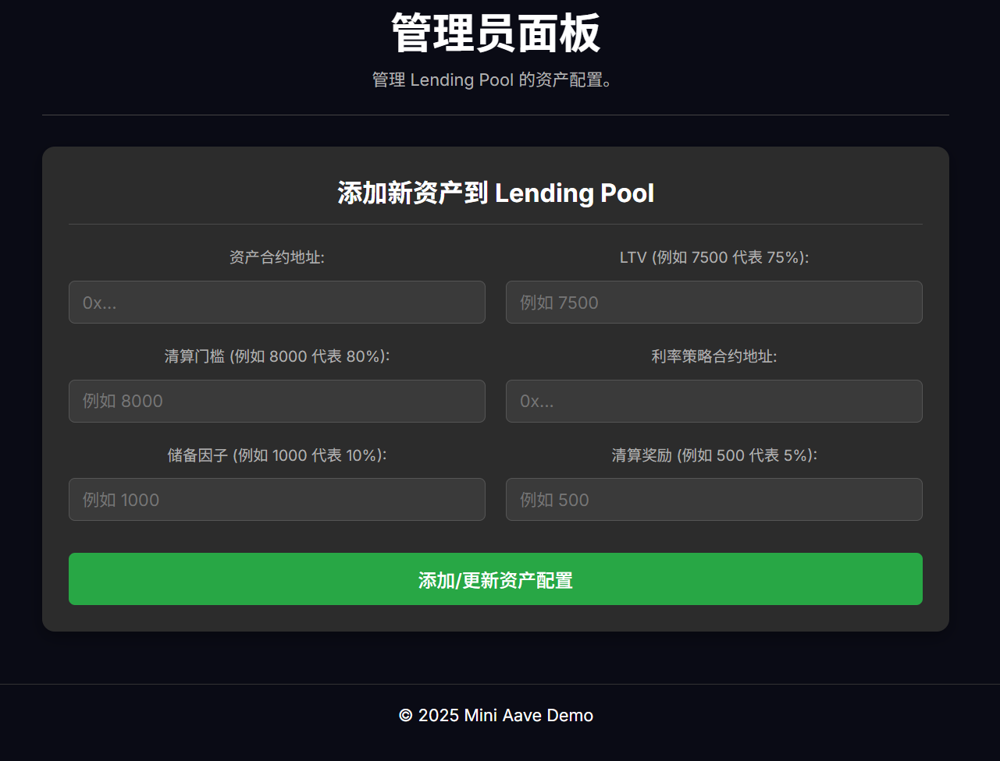

# Mini Aave Demo - Lending Protocol Project

Welcome to **Mini Aave Demo**, a simplified Ethereum-based lending protocol project that mimics the core features of major DeFi platforms like Aave. It consists of a Solidity smart contract backend (developed and tested with Foundry) and a React + Vite + TypeScript frontend interface (using Wagmi and RainbowKit for blockchain interaction).

---

## ✨ Key Features

### Core Lending Operations

* **Supply**: Users can deposit supported assets (e.g., mDAI, mUSDC) into the pool to earn interest.
* **Withdraw**: Users can withdraw their deposited assets and accrued interest.
* **Borrow**: Users can borrow other assets from the pool using their deposits as collateral.
* **Repay**: Users can repay borrowed assets with accumulated interest.

### User Dashboard

* Displays total supplied value (USD)
* Displays total borrowed value (USD)
* Shows the **Health Factor** (to indicate liquidation risk)
* Displays available borrowing capacity (USD)
* Lists supplied and borrowed assets with details (amount, value, APY/APR)

### Asset Information

* Displays supply APY and borrow APR for each asset
* Shows LTV, liquidation threshold, reserve factor, and liquidation bonus
* Displays available liquidity for each asset in the pool





### Liquidation Center

* Check any user's health factor
* If HF < 1, liquidators can repay a portion of the debt and seize collateral at a discount



### Flash Loans (Basic Demo)

* A simple UI to execute a one-time flash loan using a pre-set receiver contract


### Wallet Connection

* Integrates **RainbowKit** for wallet connection (e.g., MetaMask)
* Shows user address and balance

### Admin Panel

* Allows contract owner to configure new assets in the LendingPool via the UI


### Transaction Feedback

* Uses **react-toastify** to show toast notifications for transaction status
---

## 🛠️ Tech Stack

### Smart Contracts (Backend)

* Solidity ^0.8.20
* Foundry (Forge for compilation, testing, deployment)
* OpenZeppelin Contracts

### Frontend

* React + Vite + TypeScript
* Wagmi (React Hooks for Ethereum)
* Viem (Blockchain RPC communication)
* RainbowKit (Wallet UI)
* react-query (data fetching)
* react-router-dom (page navigation)
* react-toastify (notifications)
* CSS Modules

---

## 🗂️ Project Structure (Monorepo)

```
mini-aave/
├── contracts/                  # Foundry project for smart contracts
│   ├── src/                    # Solidity source code
│   ├── script/                 # Deployment scripts
│   ├── test/                   # Solidity tests
│   ├── foundry.toml            # Foundry config
│   ├── out/, broadcast/, ...   # Build and broadcast outputs
│
├── frontend/                  # React frontend project
│   ├── src/
│   │   ├── components/         # Reusable components
│   │   ├── pages/              # Page-level components
│   │   ├── config/             # Contract addresses and ABIs
│   │   ├── hooks/              # Custom React Hooks
│   │   ├── types/, utils/      # Types and utilities
│   ├── public/, package.json   # Static files and deps
```

---

## 🚀 Getting Started

### Prerequisites

Ensure the following tools are installed:

* Node.js (v18 or above)
* Yarn or npm
* Foundry (Forge + Anvil)
* Git
* MetaMask

### 1. Clone the Repository

```bash
git clone git@github.com:Aiangk/mini-aave-demo.git
cd mini-aave-demo
```

### 2. Setup Environment Variables

Create a `.env` file inside `contracts/`:

```env
# Example .env
PRIVATE_KEY=0xac0974be...      # Anvil default private key
RPC_URL=http://127.0.0.1:8545
```

### 3. Start Local Anvil Node

```bash
anvil
```

### 4. Deploy Smart Contracts

```bash
cd contracts
forge script script/Deploy.s.sol --rpc-url http://127.0.0.1:8545 --broadcast -vvvv
```

### 5. Update Frontend Contract Configs

Edit `frontend/src/config/contracts/index.ts` with deployed contract addresses.
Also update ABI files from `contracts/out/*/*.json` into `frontend/src/config/contracts/abis/`.

### 6. Launch Frontend Dev Server

```bash
cd frontend
yarn install
yarn dev
```

### 7. Setup MetaMask Network

* Network name: Anvil Local
* RPC URL: [http://127.0.0.1:8545](http://127.0.0.1:8545)
* Chain ID: 31337
* Currency Symbol: ETH
* Import Anvil accounts using private keys from Anvil output

### 8. Use the DApp

* Deposit, withdraw, borrow, repay
* View dashboard and health factor
* Try liquidation using a preset undercollateralized address (e.g., Bob)
* Use flash loan demo
* Admin functions if connected with owner account

---

## 🧪 Run Tests

```bash
cd contracts
forge test -vvv
```

---

## 📘 License

MIT

---

## 📌 Notes

* Never commit your `.env` file with real private keys to public repos
* Health Factor is critical: HF < 1 means your account is subject to liquidation
* This project is for demonstration/educational purposes. Do not use in production.
