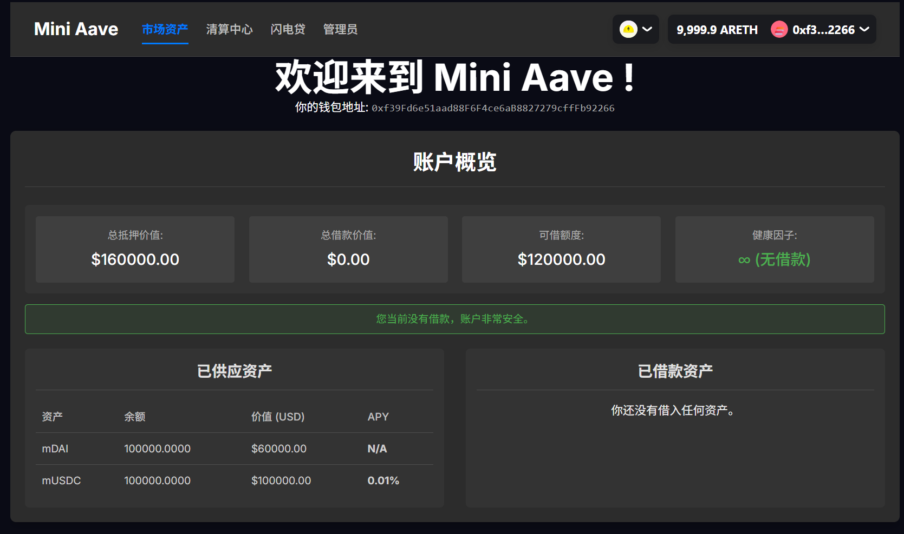
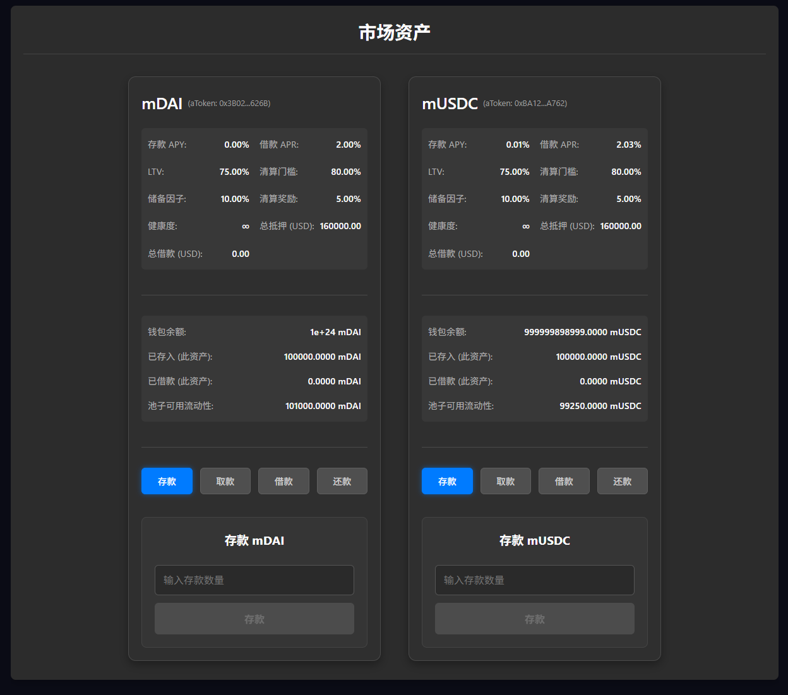
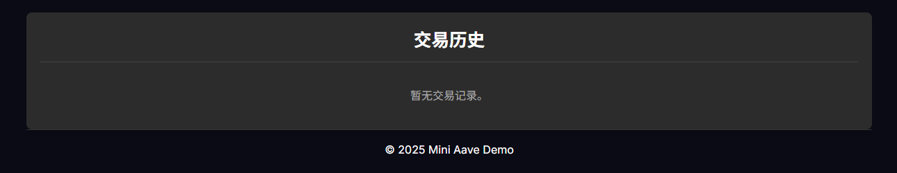
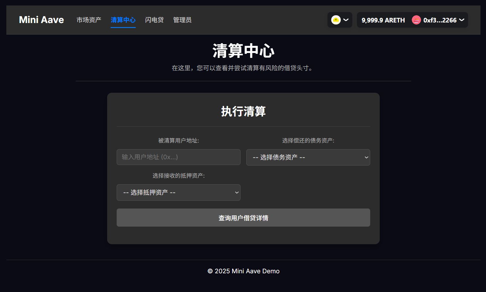
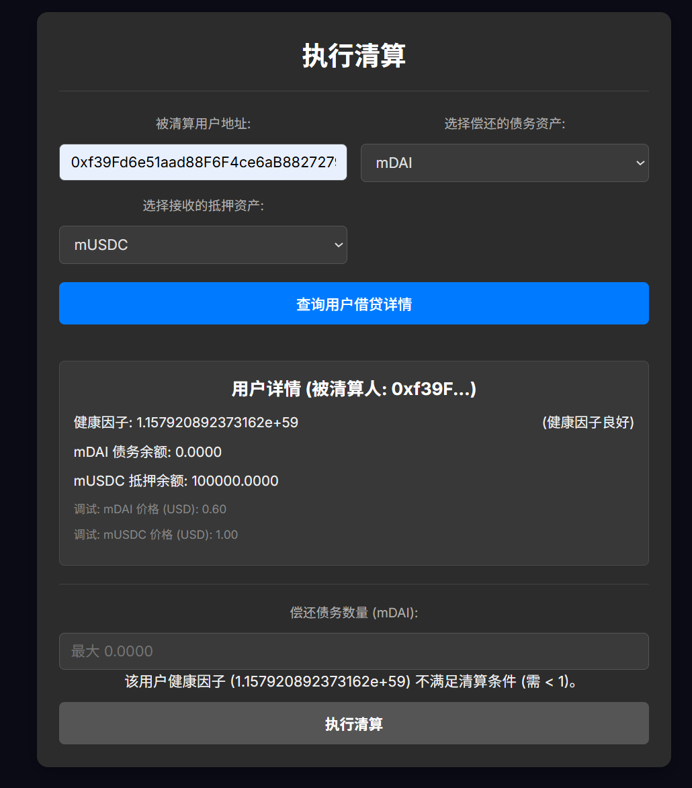
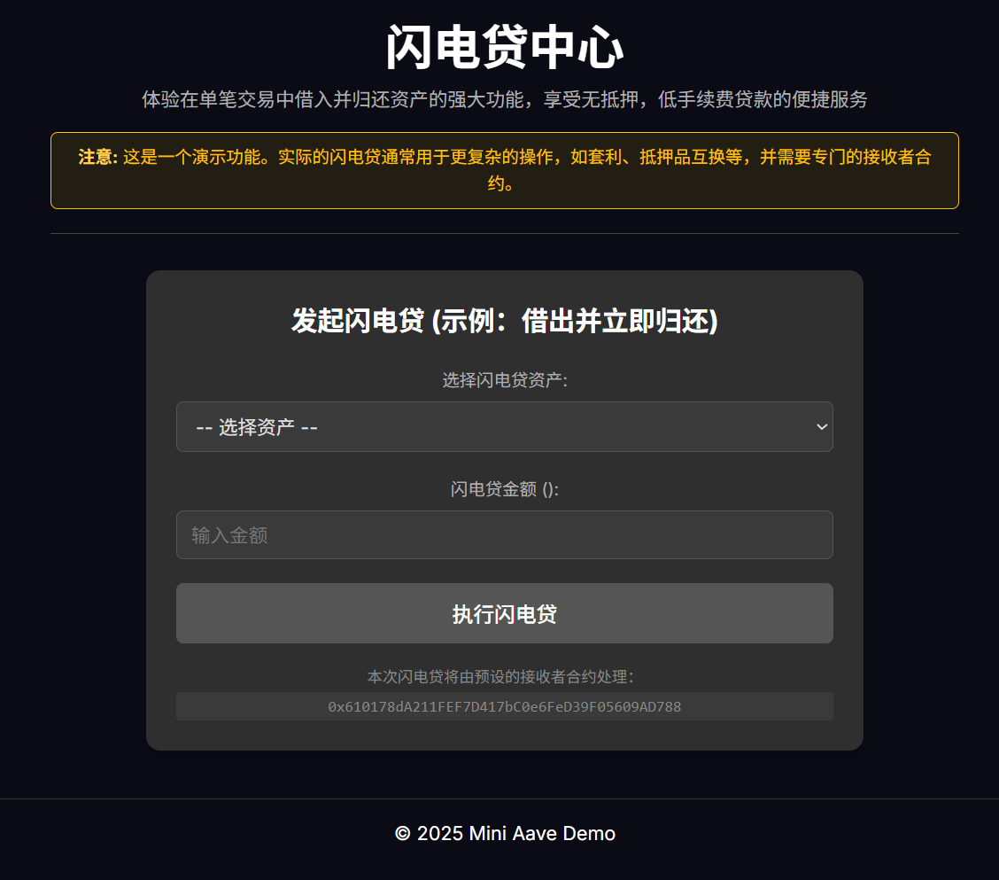
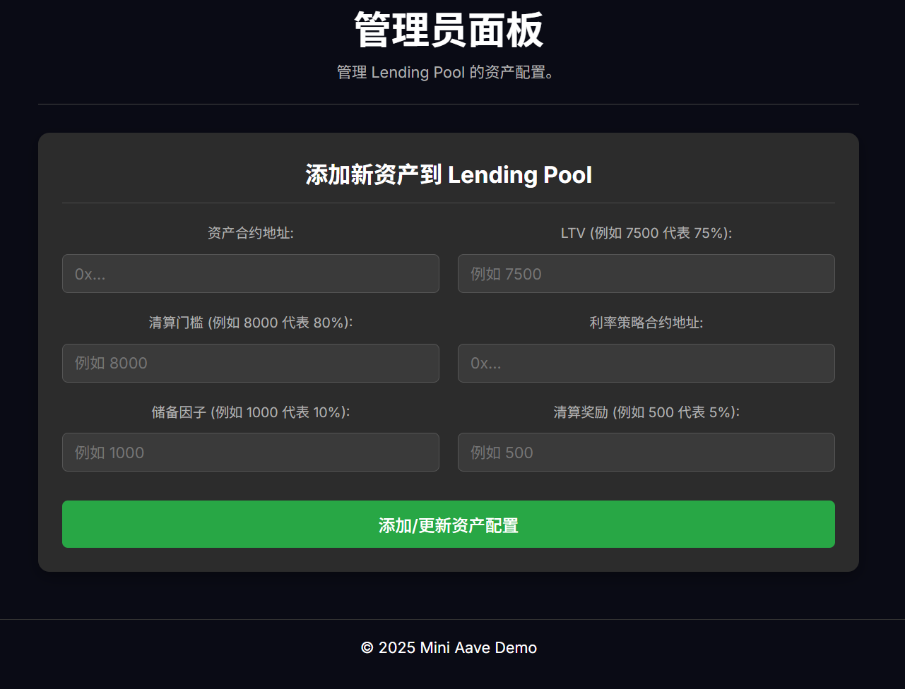

## 🏦 Mini Aave Demo - 借贷协议演示项目

欢迎来到 Mini Aave Demo！这是一个简化版的基于以太坊的借贷协议，模拟 Aave 等主流 DeFi 平台的核心功能。

项目包含：

* **Solidity 智能合约后端**（使用 Foundry 编写与测试）
* **React 前端界面**（使用 Vite + TypeScript，结合 Wagmi 和 RainbowKit 实现链上交互）

---

## ✨ 主要功能

### 🧾 核心借贷操作

* **存款 (Supply)**：存入支持资产（如 mDAI、mUSDC）并赚取利息
* **取款 (Withdraw)**：提取资产及其利息
* **借款 (Borrow)**：以存款作为抵押借出其他资产
* **还款 (Repay)**：偿还借款和利息

### 📊 用户账户面板
* 总供应价值 (USD)
* 总借款价值 (USD)
* 健康因子 (Health Factor)
* 可借额度 (USD)
* 已供应/借款的资产明细（数量、价值、APY、APR）

### 💰 资产市场信息

* 每种资产的存款 APY 与借款 APR
* LTV、清算门槛、储备因子、清算奖励
* 池中可用流动性




### ⚔️ 清算机制

* 查询账户健康状况
* 如果 HF < 1，执行清算并获得其抵押资产



### ⚡ 闪电贷（演示版）

* 执行一次性借出-归还的 FlashLoan 流程


### 🔐 钱包连接

* 支持 MetaMask 等钱包（通过 RainbowKit）
* 显示钱包地址和余额

### 🛠️ 管理员功能

* 通过 UI 修改资产信息或添加新资产（仅限合约所有者）


### 🔔 交易状态反馈

* 使用 `react-toastify` 提示交易进度、成功或失败
---

## 🛠 技术栈

### 合约端

* Solidity ^0.8.20
* Foundry（Forge 编译、测试、部署）
* OpenZeppelin

### 前端

* React + Vite + TypeScript
* wagmi + viem（区块链交互）
* RainbowKit（钱包连接 UI）
* TanStack React Query（数据获取）
* react-router-dom（路由）
* react-toastify（通知）
* CSS Modules

---

## 📁 项目结构（Monorepo）

```
contracts/
├── src/           # Solidity 合约
├── script/        # 部署脚本
├── test/          # 测试文件
├── foundry.toml   # Foundry 配置
├── out/           # ABI 编译产物
└── .env           # 私钥配置（本地）

frontend/
├── src/
│   ├── components/   # 可复用组件
│   ├── pages/        # 页面组件
│   ├── config/       # 合约地址 & ABI
│   ├── hooks/        # 自定义 hooks
│   ├── types/        # 类型定义
│   └── utils/        # 工具函数
├── public/
├── package.json
└── vite.config.ts
```

---

## 🚀 快速开始

### ✅ 环境准备

确保安装：

* Node.js ≥ v18
* Yarn / npm
* Foundry（包含 Forge 和 Anvil）
* Git
* MetaMask 插件

### 1. 克隆仓库

```bash
git clone git@github.com:Aiangk/mini-aave-demo.git
cd mini-aave-demo
```

### 2. 配置环境变量

在 `contracts/` 或根目录创建 `.env`：

```env
PRIVATE_KEY=0xac09...  # Anvil 账户私钥
RPC_URL=http://127.0.0.1:8545
```

> ⚠️ 请勿提交 `.env` 文件到公共仓库

### 3. 启动本地链

```bash
anvil
```

### 4. 部署合约

```bash
cd contracts
forge script script/Deploy.s.sol --rpc-url http://127.0.0.1:8545 --broadcast -vvvv
```

### 5. 更新前端合约地址与 ABI

编辑：`frontend/src/config/contracts/index.ts`

* 替换合约地址：如 LENDING\_POOL\_ADDRESS、MDAI\_ADDRESS 等
* 替换 ABI 内容（从 `contracts/out/...` 获取）

### 6. 启动前端

```bash
cd frontend
yarn install
yarn dev  # 或 npm run dev
```

访问：[http://localhost:5173](http://localhost:5173)

### 7. 设置 MetaMask

* 网络名：Anvil Local
* RPC URL：[http://127.0.0.1:8545](http://127.0.0.1:8545)
* Chain ID：31337
* 添加账户私钥：部署者、Bob（可清算账户）等

### 8. 使用 DApp

* 存取借还资产
* 查看用户财务面板
* 尝试清算 Bob：`0x7099...`
* 体验闪电贷演示
* 使用管理员面板添加资产（仅限 owner）

---

## 🧪 测试

```bash
cd contracts
forge test -vvv
```

---

## 📌 注意事项与演示技巧

* 📉 **清算演示**：Bob 的健康因子默认低于 1，方便直接操作
* 🛡 **健康因子机制**：确保避免 HF < 1，否则面临清算
* 📈 **交易历史追踪**：DApp 中实时监听 LendingPool 合约事件
* 🔐 **权限控制**：只有 Configurator 的 owner 可执行管理员操作

---

## 📜 许可证

MIT License
